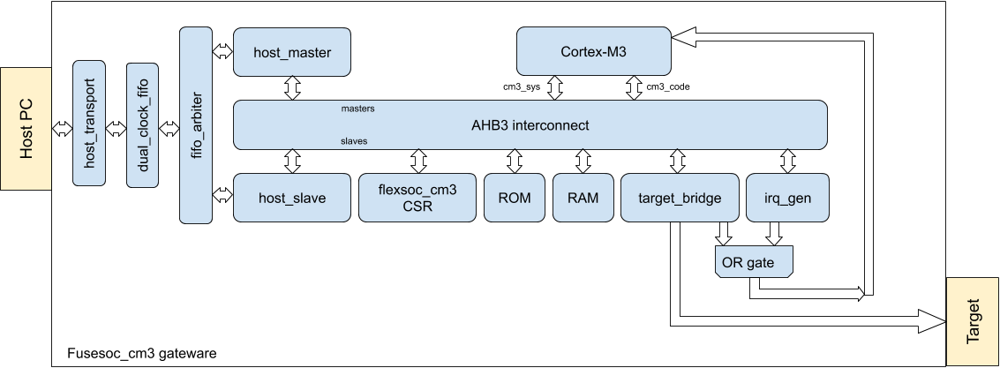

# flexsoc_cm3
flexsoc_cm3 is a flexible system on chip emulator for the ARM Cortex-M3. The goal is to be able to emulate any Cortex-M3 based chip from any vendor using custom gateware and a host application which can map the memory space appropriately. This approach allows code which is developed on flexsoc_cm3 to run on the target SoC without changes, ifdefs, etc. Conversely, code which is written for a specific SoC can be run/debugged on flexsoc_cm3 without changes. This can be extremely useful for both rapid prototyping a new platform and reverse engineering a platform developed by someone else. 

## Architecture
To maintain maximum flexibility there are a few building blocks which comprise flexsoc_cm3. Here is a high level block diagram.

On the host side you specify a system map file which sets up mapping such as:
* Remap the ROM (0x0800.0000 for STM32)
* Map any target peripherals to expected location
* Load and bind virtual peripheral plugins on the host
* Connect virtual peripheral plugins to virtual interfaces ie:
  * serial driver
  * serial TCP server
  * GPIO source/sinks
  * LCD emulator
  * sensors, etc
  
## Memory map
    0x0000.0000 - ROM (Can be remapped)
    0x2000.0000 - RAM
    0xE000.0000 - Private peripheral bus (only accessible by CM3 code)
    0xF000.0000 - flexsoc_cm3 CSR (control/status registers) - Only visible to host
Any bus transaction that doesn't match a slave will be forwarded to the host. This creates a lot of flexibility. For instance, a host plugin can log all peripheral accesses and then pass them on to the real target using the target bridge. Or a particular peripheral can instantiated using a virtual peripheral plugin and handled directly on the host.

## Hardware
The gateware leverages the fusesoc build system to easily compile on using various EDA tools as well as full simulation using verilator. The goal is to support as many hardware platforms as possible (only a host connection and a few IO for the bridge are necessary) to maximize utility for users.

Initial support is for the Digilent Arty (A35T) platform as I have one and they seem to be popular.

I am working on a custom board that contains two fast (single cycle) 8MB memories for ROM/RAM as well as a higher speed async FIFO connection via FT2232H. This should hopefully be available at some point...
